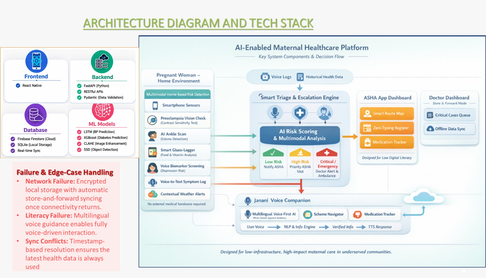

<h1 align="center">
  
   
  🏥 Janani-Setu (Maa App)
</h1>

  <em>An elegant, offline-first, AI-powered maternal health ecosystem built for rural India.</em>

  📱 <a href="https://drive.google.com/drive/folders/1BFjBYui9lu1klKmx-yAdOaApr2hXAo3Z?usp=sharing">Download APK</a>
  &nbsp;|&nbsp;
  🎥 <a href="https://youtu.be/WHEuceStFCs">Watch Demo Video</a>

## 🚨 The Problem
Maternal and infant health outcomes in rural India remain a critical challenge due to isolated geography, a severe shortage of specialist doctors, and unreliable infrastructure. Traditional frontline health workers (ASHAs) are overburdened and rely on manual tracking, leading to delayed interventions.

> **❗️ Critical Reality:**  
> **In India, 1 out of 3 pregnant women is at risk, and India contributes to a staggering 8.5% of global maternal deaths.**

---

## 💡 Our Solution
**Janani-Setu** acts as an intelligent bridge ("Setu") connecting pregnant mothers, ASHA workers, and doctors. By bringing predictive risk analysis, real-time diagnostics, and unified health tracking directly to mobile devices without requiring internet access, Janani-Setu democratizes life-saving maternal care.

---

## 🌟 Core Features

### 🤰 Maternal View (For Pregnant Women)
Designed to empower mothers with self-monitoring tools and vital insights:
- **🩸 Smart Gluco Tracker:** Seamlessly log and monitor blood glucose levels.
- **🚨 SOS via SMS:** One-tap offline emergency alerts sent directly via SMS to family and health workers.
- **👁️ Vision Test:** On-device diagnostic test to check for vision impairments often linked to preeclampsia.
- **🩺 BP & Diabetes Prediction:** AI-driven prediction models for the early detection of gestational diabetes and hypertension.
- **🦶 Ankle Scan Feature:** Automated swelling/edema checks using device cameras to assess preeclampsia risk.
- **✨ Micro-Features & Habit Tracking:** 
  - 👶 **Baby Kick Counter**
  - 🤒 **Symptom Tracker**
  - ⚖️ **Weight & Clinic Visit Tracker**
  - 💧 **Water Intake Tracker**
  - 💊 **Medicine Tracker**
  - 📚 **Knowledge Resources:** Interactive educational modules and visual guides to gain knowledge from.

### 👩‍⚕️ ASHA View (For Health Workers)
Reducing administrative burden and optimizing fieldwork:
- **🗺️ Smart Risk-Based Routing:** Intelligently maps an ASHA worker's daily route by prioritizing patients with the highest risk scores.
- **📝 Clinical Notes:** ASHA workers can securely leave patient notes that are seamlessly synced with doctors.
- **💊 Patient Medicine Tracking:** Monitor and verify patient medication adherence directly from the field.

### 👨‍⚕️ Doctor View (For Specialists)
Enabling rapid diagnostic overview and intervention:
- **🚑 Smart Routing & Triage:** Automatically surfaces critical, high-risk cases needing immediate attention.
- **📋 Collaborative Notes:** Doctors can leave prescriptive notes and feedback directly for ASHA workers to act upon during field rounds.

---

## 📶 Engineered for Zero-Connectivity & Rural Realities
Janani-Setu is built explicitly for the technological constraints of rural India:
- **🚫 No-Internet Fallbacks:** True offline-first architecture. All core diagnostics (Ankle Scan, Gluco-Tracker, Vision Tests) function perfectly without any network. Data is stored locally and syncs automatically only when a connection is available.
- **🗣️ Voice-First & Multilingual:** Eliminates literacy barriers with intuitive voice-based interactions and local language support, making it accessible to every mother.
- **⚙️ Local Edge Processing:** AI models run directly on the smartphone. This ensures instant results and total data privacy, even in heartland areas with zero signal.
- **💾 "Lite" Storage Optimization:** Highly optimized to run smoothly on older, low-end Android devices without draining battery or hoarding storage.

---

## 🏗️ Technology Stack & Architecture
Janani-Setu utilizes a robust, "store-and-forward" architecture designed for high-impact maternal care in underserved communities.

  

### 🛠️ The Stack
- **Frontend:** React Native (Cross-platform mobile)
- **Backend:** FastAPI (Python), RESTful APIs, Pydantic (Data Validation)
- **Database:** Firebase Firestore (Cloud), SQLite (Local Storage), Real-time Sync
- **ML Models:** 
  - **LSTM:** Blood Pressure Prediction
  - **XGBoost:** Diabetes Risk Prediction
  - **CLAHE:** Image Enhancement for diagnostics
  - **SSD:** Object Detection for nutritional analysis

### 🛡️ Failure & Edge-Case Handling
- **Network Failure:** Encrypted local storage with automatic store-and-forward syncing once connectivity returns.
- **Literacy Failure:** Multilingual voice guidance enables fully voice-driven interaction.
- **Sync Conflicts:** Timestamp-based resolution ensures the latest health data is always prioritized.

---

## 🤖 Model Accuracy & Performance
Our embedded predictive models are optimized for both extreme lightweight deployment and high clinical reliability:
- **Blood Pressure (BP) Prediction [LSTM Model]:** Achieves a Mean Absolute Error (MAE) of **0.83 mmHg**.
- **Gestational Diabetes Risk [XGBoost Model]:** Achieves an F1 Score of **0.56**, flagging at-risk mothers for timely intervention.

---

## 💰 Business Model & Scalability
To serve the most vulnerable populations, Janani-Setu operates on a highly frugal B2G (Business-to-Government) and B2NGO model:
> **Our architecture ensures operational costs of less than $1 per user, per year.**

- **Eliminates Cloud Costs:** By running AI and ML at the edge (on-device), we completely bypass expensive server API calls.
- **Micro-Data Syncing:** Aggressive local data compression means cloud sync payloads are only mere kilobytes.
- **Existing Infrastructure:** Deployed via existing ASHA worker smartphone networks, eliminating hardware rollout friction.
